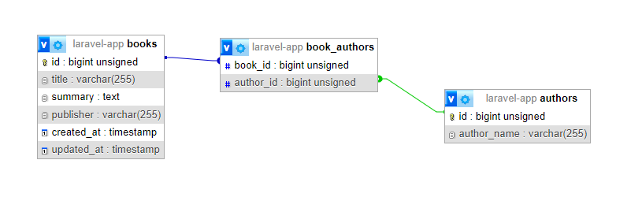
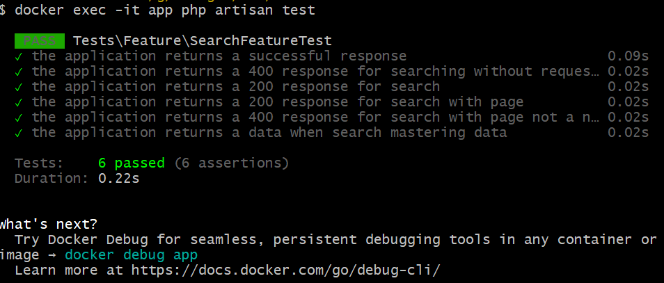

# Requirement
## Search

Assume that you're being hired by BookReader company which is a book marketplace and has millions of books and audiobooks from publishers worldwide. Please develop an application with Laravel that provides a search API for end-users. It is essential for the business so their customers can find their books in a reasonable amount of time.

- The system should have a single api endpoint like <http://bookreaders.test/search/book?q={keyword}>
- The `keyword` can be a `title`, `summary`, `publisher`, or `authors`.
- The final JSON data model for a response should contain these values:

```json
{
    "id": 1234,
    "publisher": "Some Fancy Publisher",
    "title": "Mastering Something",
    "summary": "Long summary",
    "authors": [
        "Lovely Author One",
        "Lovely Author Two"
    ]
}
```

## DB design
<p align="center">  </p>

## Folder Structure
```
├───app
│   ├───Http
│   │   ├───Controllers
│   │   └───Requests
│   ├───Models
│   ├───Providers
│   ├───Repositories <- Repository Pattern
│   └───Services <- Business Logic
├───bootstrap
│   └───cache
├───build <- Docker build files
│   └───docker
│       ├───apache2
│       │   └───conf.d
│       ├───mysql
│       └───sql
├───config
├───database
│   ├───factories
│   ├───migrations
│   └───seeders
├───docs <- Documentation
├───mysql-data <- MySQL data folder
├───public
├───resources
│   ├───css
│   ├───js
│   ├───scss
│   └───views
├───routes
├───storage
│   ├───app
│   │   └───public
│   ├───framework
│   │   ├───cache
│   │   │   └───data
│   │   ├───sessions
│   │   ├───testing
│   │   └───views
│   └───logs
└───tests
    ├───Feature
    └───Unit
```

## Installation
### Requirements
- Docker
### Technologies
- PHP 8.3
- Laravel 11.5
- MySQL 8.0
- Apache 2.4
- Composer 2.1

### Package used
- `laravel/sanctum` - for API

### Installation
1. Clone the repository
2. Run `docker-compose up -d`
3. Connect application in [http://localhost:8080](http://localhost:8080)

### API Endpoint
- Search: <http://localhost:8080/api/search/book?q={keyword}&page={page}>
- method: GET
- parameter
  - `keyword` - search keyword
  - `page` - page number
- response
  - `id` - book id
  - `publisher` - book publisher
  - `title` - book title
  - `summary` - book summary
  - `authors` - book authors
- example: <http://localhost:8080/api/search/book?q=Mastering&page=1>

### Testing
- After installation, Run `docker-compose exec app php artisan test`
- It will run the test cases



### Note
- The search is FTS(Full Text Search) based on the `title`, `summary`, `publisher`, and `authors` fields.
- Sample data is available in `build/docker/sql/sample.sql`.
